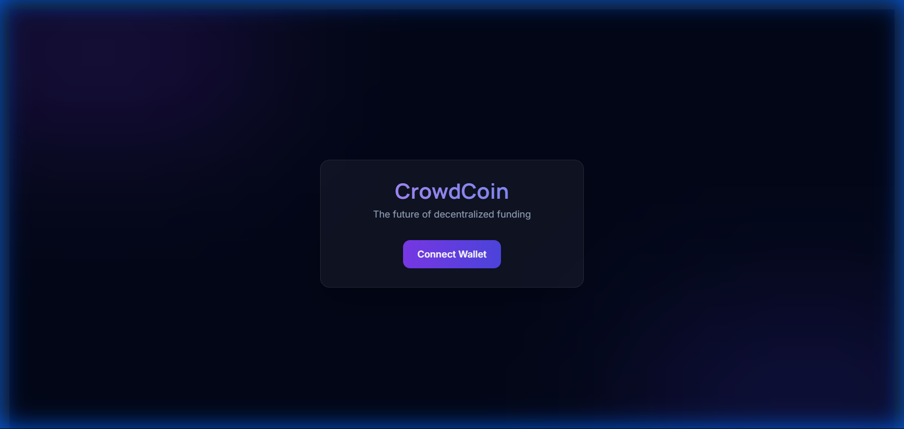

<div align="center">
  

  # CrowdCoin
  ### The Future of Decentralized Funding

  [](https://reactjs.org/)
  [](https://vitejs.dev/)
  [](https://soliditylang.org/)
  [](https://sepolia.etherscan.io/)
  [](./LICENSE)
  []()

  <p align="center">
    <a href="https://vercel.com/new/clone?repository-url=https%3A%2F%2Fgithub.com%2FShalini180%2FHC-hacKnight-Crowdfunding">
      
    </a>
  </p>
</div>

---

## 🌌 Feature Spotlights

### Galactic Authentication
Experience a seamless entry into the Web3 universe. Our deep-space glassmorphism login integrates directly with MetaMask, providing secure and stylish access.


### 🚀 Seamless Minting
Launch your vision in seconds. The campaign creation wizard features a drag-and-drop IPFS upload zone with real-time preview and instant smart contract minting.


### 🛍️ Immersive Discovery
Explore the ecosystem through a masonry-style feed. Each campaign card is a portal to innovation, featuring glowing hover effects and live progress tracking.


### 💸 Sticky Funding Dock
A high-conversion checkout experience. The sticky funding dock ensures backers can support projects instantly without losing context of the campaign story.


---

## 🛠️ Tech Stack

| Frontend | Backend | Infrastructure |
| :--- | :--- | :--- |
| **React 18** | **Solidity** | **IPFS (Pinata)** |
| **Vite** | **Hardhat** | **Sepolia Testnet** |
| **Tailwind CSS** | **Ethers.js** | **Alchemy RPC** |
| **Framer Motion** | **OpenZeppelin** | **Vercel** |

---

## 🚀 Zero-Friction Setup

### 1. Clone the Repository
```bash
git clone https://github.com/Shalini180/HC-hacKnight-Crowdfunding.git
cd HC-hacKnight-Crowdfunding
```

### 2. Configure Secrets
Create a `.env` file in the `client/` directory based on the structure below:

```env
# Client Secrets (client/.env)
VITE_PINATA_JWT=your_pinata_jwt_token_here
VITE_CONTRACT_ADDRESS=0xYourDeployedContractAddress
```

For backend deployment, create a `.env` in the root:
```env
# Root Secrets (.env)
SEPOLIA_RPC_URL=https://eth-sepolia.g.alchemy.com/v2/your-api-key
PRIVATE_KEY=your_wallet_private_key
```

### 3. Launch Locally
Start the development server and blast off! 🚀

```bash
cd client
npm install
npm run dev
```

### 4. Deploy Smart Contracts
If you want to deploy your own instance of the contract:

```bash
npm install
npx hardhat run scripts/deploy.js --network sepolia
```

---

<div align="center">
  <p>Built with ❤️ for the <strong>HackNight</strong> Hackathon.</p>
  <p><i>Design inspired by the cosmos. Logic powered by Ethereum.</i></p>
</div>
