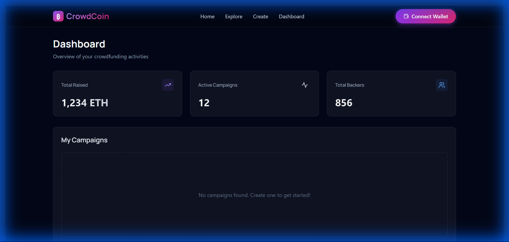
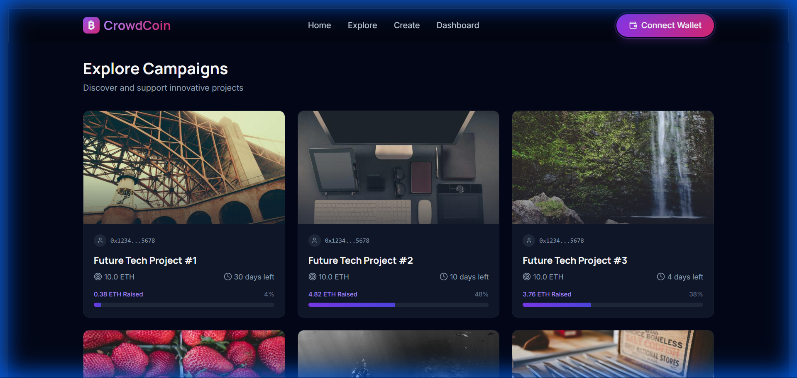
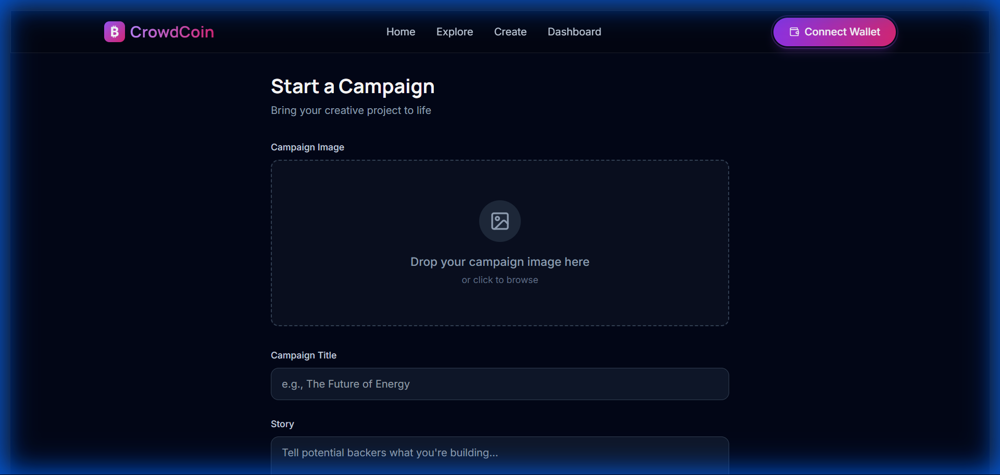
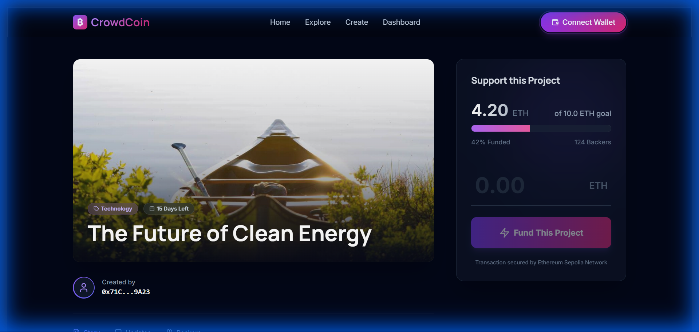

# CrowdCoin


CrowdCoin is a decentralized crowdfunding platform built on the Ethereum Sepolia network. It leverages blockchain technology to provide a transparent, secure, and efficient way for creators to raise funds and for backers to support projects.

The application features a modern, responsive user interface designed with React and Tailwind CSS, interacting with smart contracts via Ethers.js.



## Features

*   **Decentralized Authentication**: Secure login using MetaMask wallet connection.
*   **Campaign Creation**: Users can create new fundraising campaigns with details stored on IPFS (via Pinata) and the blockchain.
*   **Real-time Dashboard**: Interactive dashboard displaying fundraising statistics and active campaigns.
*   **Discovery Feed**: Browse and filter available campaigns with a responsive masonry layout.
*   **Secure Donations**: Direct ETH transfers to campaign smart contracts with real-time progress tracking.

## Technology Stack

### Frontend
*   **React 18**: UI library for building the interface.
*   **Vite**: Build tool and development server.
*   **Tailwind CSS**: Utility-first CSS framework for styling.
*   **Framer Motion**: Library for UI animations.
*   **Lucide React**: Icon set.

### Backend & Blockchain
*   **Solidity**: Smart contract programming language.
*   **Hardhat**: Ethereum development environment for compiling, deploying, and testing.
*   **Ethers.js**: Library for interacting with the Ethereum blockchain.
*   **IPFS (Pinata)**: Decentralized storage for campaign media and metadata.
*   **Sepolia Testnet**: Ethereum test network for deployment.

## Getting Started

### Prerequisites
*   Node.js (v16 or higher)
*   npm or yarn
*   MetaMask browser extension

### Installation

1.  **Clone the repository**
    ```bash
    git clone https://github.com/Shalini180/HC-hacKnight-Crowdfunding.git
    cd HC-hacKnight-Crowdfunding
    ```

2.  **Install dependencies**
    ```bash
    # Install root dependencies (for Hardhat)
    npm install

    # Install client dependencies (for React)
    cd client
    npm install
    cd ..
    ```

3.  **Environment Configuration**

    Create a `.env` file in the root directory for Hardhat:
    ```env
    SEPOLIA_RPC_URL=https://eth-sepolia.g.alchemy.com/v2/YOUR_ALCHEMY_KEY
    PRIVATE_KEY=YOUR_WALLET_PRIVATE_KEY
    ```

    Create a `.env` file in the `client/` directory for the frontend:
    ```env
    VITE_PINATA_JWT=YOUR_PINATA_JWT_TOKEN
    VITE_CONTRACT_ADDRESS=YOUR_DEPLOYED_CONTRACT_ADDRESS
    ```

### Deployment

To deploy the smart contracts to the Sepolia testnet:

```bash
npx hardhat run scripts/deploy.js --network sepolia
```

After deployment, update the `VITE_CONTRACT_ADDRESS` in `client/.env` with the new contract address.

### Running Locally

Start the frontend development server:

```bash
cd client
npm run dev
```

The application will be available at `http://localhost:5173`.

## Screenshots

| Dashboard | Campaign Feed |
|:---:|:---:|
|  |  |

| Create Campaign | Donation |
|:---:|:---:|
|  |  |

## License

This project is licensed under the MIT License - see the [LICENSE](LICENSE) file for details.
